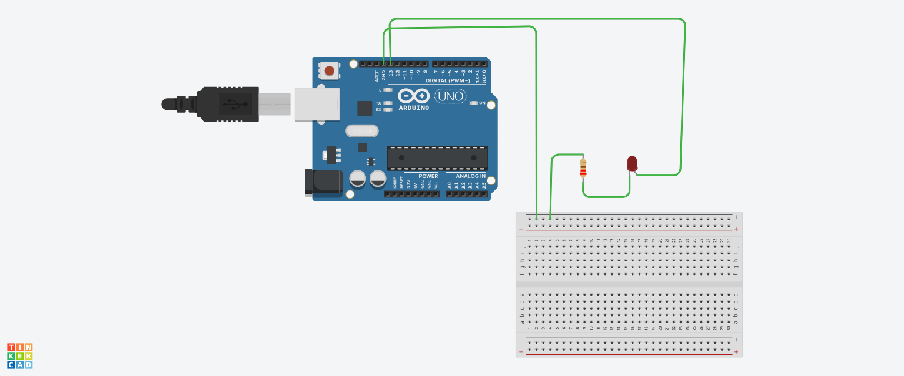

# Arduino LED Blink Project / Arduino LED Blink Projekt / Arduino LED Yanıp Sönme Projesi 🟡



## 🇹🇷 Türkçe

### 📖 Açıklama
İlk Arduino projem - basit bir LED yanıp sönme programı. Bu proje, temel dijital çıkış kontrolünü gösterir ve gömülü sistemler programlamaya giriş niteliğindedir.

### ✨ Özellikler
- ✅ LED açma/kapama kontrolü
- ✅ Ayarlanabilir yanıp sönme aralıkları
- ✅ Temel Arduino sözdizimi ve yapısı
- ✅ TinkerCAD simülasyonu uyumlu

### 🛠️ Kullanılan Bileşenler
- Arduino Uno R3
- LED (Herhangi bir renk)
- 220Ω Direnç
- Breadboard (Devre tahtası)
- Jumper kablolar

### 🔧 Kurulum & Ayarlar
1. LED'i dijital pin 13 ve GND'ye bağlayın
2. LED koruması için 220Ω direnç kullanın
3. Kodu Arduino'ya yükleyin
4. Yanıp sönen LED'i gözlemleyin

### 💻 Kod Örneği
```cpp
void setup() {
  pinMode(13, OUTPUT);  // Pin 13'ü çıkış olarak ayarla
}

void loop() {
  digitalWrite(13, HIGH);  // LED'i aç
  delay(1000);             // 1 saniye bekle
  digitalWrite(13, LOW);   // LED'i kapat
  delay(1000);             // 1 saniye bekle
}'
## 🌐 English
### 📖 Description
This is my first Arduino project. I'm starting with Arduino through a simple LED blink program.

### 🛠️ Components Used
-Arduino Uno
-LED
-220Ω Resistor
-Breadboard
-Jumper wires

### 🔧 Circuit Diagram
LED long leg (+) → Digital Pin 13

LED short leg (-) → 220Ω Resistor → GND

### 💻 Code
```cpp
void setup() {
  pinMode(13, OUTPUT);
}

void loop() {
  digitalWrite(13, HIGH);
  delay(1000);
  digitalWrite(13, LOW);
  delay(1000);
}
## 🇩🇪 Deutsch
### 📖 Beschreibung
Dies ist mein erstes Arduino-Projekt. Ich beginne mit Arduino durch ein einfaches LED-Blinkprogramm.

### 🛠️ Verwendete Komponenten
-Arduino Uno
-LED
-220Ω Widerstand
-Steckbrett
-Verbindungskabel

### 🔧 Schaltplan
LED langes Bein (+) → Digitalpin 13

LED kurzes Bein (-) → 220Ω Widerstand → GND

### 💻 Code
```cpp
void setup() {
  pinMode(13, OUTPUT);
}

void loop() {
  digitalWrite(13, HIGH);
  delay(1000);
  digitalWrite(13, LOW);
  delay(1000);
}
